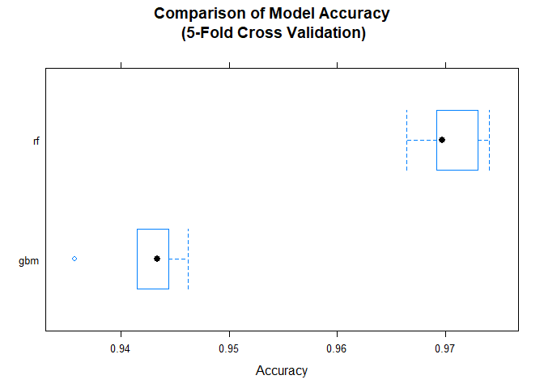

## Overview
The data set for this project comes from this [website](http://groupware.les.inf.puc-rio.br/har). It includes information obtained from on-body sensors on six participants who each performed a weight lifting exercise. The exercise was performed correctly (class A in the classe column) and incorrectly in 4 different ways (classes B, C, D, and E). The goal is to fit a model to the dataset that will accurately predict which version of the exercise was performed (or in other words, if the exercise was performed correctly or not). A random forest model and gradient boosting model were compared using the `caret` package and 5-fold cross validation. Accuracy was used to pick the best model, which in the end was the random forest. Further information can be found in this [paper](http://groupware.les.inf.puc-rio.br/work.jsf?p1=11201).
  
  
## Downloading the Data
For this project there are two data sets. The training data set contains the data that we will build and test the models on. The testing data set only contains 20 rows and excludes the response variable (classe). The testing data set will only be used for a quiz at the end of the project.

```r
training <- read.csv("https://d396qusza40orc.cloudfront.net/predmachlearn/pml-training.csv", 
                     stringsAsFactors = FALSE,
                     na.strings = c("NA", "", "#DIV/0!"))
testing <- read.csv("https://d396qusza40orc.cloudfront.net/predmachlearn/pml-testing.csv",
                    stringsAsFactors = FALSE,
                    na.strings = c("NA", "", "#DIV/0!"))
```

## Exploring the Data
The response variable (classe) and a predictor variable (user_name) are changed to factor variables. For the purposes of this project we will use the `user_name` column because it most likely will improve the accuracy of our models (given that it represents different performers of the exercise). A more practical model might exclude this column to see how well the model can predict exercise performance regardless of the performer. 

```r
training$classe <- factor(training$classe)
training$user_name <- factor(training$user_name)
testing$user_name <- factor(testing$user_name)
```

Below we create a table of the response variable. The five classes seem to be represented fairly well in the data, so our models will most likely not be affected by overly expressed classes.


```r
table(training$classe)
```

```
## 
##    A    B    C    D    E 
## 5580 3797 3422 3216 3607
```

Some of the columns have almost all missing values. We will simply exclude these columns rather than impute. The unique amounts of missing values tells us that all the columns that have missing values are almost completely missing.


```r
sum_missing <- colSums(is.na(training))
sum_missing <- sum_missing[sum_missing != 0]
unique(sum_missing)
```

```
##  [1] 19226 19248 19622 19225 19216 19294 19296 19227 19293 19221 19218
## [12] 19220 19217 19300 19301 19299
```

## Prepairing Data for Model Fitting
Below we remove the NA columns and the timestamp columns. They will not be needed for training our models as we will only be using the data obtained from the body sensors.


```r
NA_cols <- which(apply(is.na(training), 2, any))
training.reduced <- training[, -c(1,3,4,5,6,7, NA_cols)]
testing.reduced <- testing[, -c(1,3,4,5,6,7, NA_cols)]
```

Below we check for variables that have near zero and zero variance. However, when using the defaults of the `nearZeroVar` caret function (freqCut = 19 and uniqueCut = 10) none of the variables have near zero variance, so all variables will be used when training the models. 


```r
library(caret)
zerVar <- nearZeroVar(training.reduced)
length(zerVar)
```

```
## [1] 0
```

Below we split `training.reduced` into train and test sets. The train set is 80% of the full training set and the test set is 20%.


```r
set.seed(4444)
rows <- sample(nrow(training.reduced)) # shuffle rows
training.reduced <- training.reduced[rows, ]
split <- round(nrow(training.reduced)*0.80) # 80/20 split
train <- training.reduced[1:split, ]
test <- training.reduced[(split+1):nrow(training.reduced), ]
```

Below we separate the response column from the predictor columns (to be used when building our models). We also create the five folds of the data that will be used for cross validation for both of our models. This is done here so that the folds are the same for both the random forest model and the gradient boosting model. This allows for a fair comparison later on.


```r
library(ranger)
library(gbm)
train_x <- train[,-54]
train_y <- train[, 54] # classe
set.seed(4444)
myFolds <- createFolds(train_y, k = 5)
myControl <- trainControl(method = "cv",
                          number = 5,
                          savePredictions = TRUE,
                          index = myFolds,
                          summaryFunction = defaultSummary) # just use accuracy to determine best model
```

## Model Fitting and Selection
Now we can fit a random forest model with the `caret` package using the `ranger` package. The ranger package was used instead of the `randomForest` package because it tends to run faster. We use the control we created above that specifies to use 5-fold cross validation and accuracy to select the best model (based on differing default tuning parameters).


```r
set.seed(4444)
model_rf <- train(x = train_x, y = train_y, method = "ranger", trControl = myControl)
```

```
## Growing trees.. Progress: 87%. Estimated remaining time: 4 seconds.
## Growing trees.. Progress: 79%. Estimated remaining time: 8 seconds.
## Growing trees.. Progress: 80%. Estimated remaining time: 7 seconds.
## Growing trees.. Progress: 86%. Estimated remaining time: 5 seconds.
## Growing trees.. Progress: 17%. Estimated remaining time: 2 minutes, 35 seconds.
## Growing trees.. Progress: 33%. Estimated remaining time: 2 minutes, 3 seconds.
## Growing trees.. Progress: 51%. Estimated remaining time: 1 minute, 30 seconds.
## Growing trees.. Progress: 68%. Estimated remaining time: 59 seconds.
## Growing trees.. Progress: 84%. Estimated remaining time: 28 seconds.
```

Below we print and plot the model and can see that the selected one use mtry set to 53. So 53 variables are randomly selected at each node of each tree (as opposed to using 2 or 27).


```r
model_rf
```

```
## Random Forest 
## 
## 15698 samples
##    53 predictor
##     5 classes: 'A', 'B', 'C', 'D', 'E' 
## 
## No pre-processing
## Resampling: Cross-Validated (5 fold) 
## Summary of sample sizes: 3139, 3139, 3140, 3139, 3141 
## Resampling results across tuning parameters:
## 
##   mtry  splitrule   Accuracy   Kappa    
##    2    gini        0.9625588  0.9526057
##    2    extratrees  0.9562522  0.9446178
##   27    gini        0.9656804  0.9565619
##   27    extratrees  0.9682123  0.9597676
##   53    gini        0.9570010  0.9455759
##   53    extratrees  0.9705057  0.9626703
## 
## Tuning parameter 'min.node.size' was held constant at a value of 1
## Accuracy was used to select the optimal model using the largest value.
## The final values used for the model were mtry = 53, splitrule =
##  extratrees and min.node.size = 1.
```

```r
plot(model_rf)
```

<!-- -->

Now we fit the gradient boosting model with the same control that we used for the random forest (including the cross validation data). 


```r
set.seed(4444)
model_gbm <- train(x = train_x, y = train_y, method = "gbm", trControl = myControl, verbose = FALSE)
```

Below we print and plot the model and can see that the final model has 150 trees and an interaction depth of 3. 


```r
model_gbm
```

```
## Stochastic Gradient Boosting 
## 
## 15698 samples
##    53 predictor
##     5 classes: 'A', 'B', 'C', 'D', 'E' 
## 
## No pre-processing
## Resampling: Cross-Validated (5 fold) 
## Summary of sample sizes: 3139, 3139, 3140, 3139, 3141 
## Resampling results across tuning parameters:
## 
##   interaction.depth  n.trees  Accuracy   Kappa    
##   1                   50      0.7482004  0.6807049
##   1                  100      0.8110747  0.7607528
##   1                  150      0.8454260  0.8043161
##   2                   50      0.8452350  0.8038968
##   2                  100      0.8980602  0.8709357
##   2                  150      0.9182060  0.8964650
##   3                   50      0.8863550  0.8560753
##   3                  100      0.9266307  0.9071378
##   3                  150      0.9422219  0.9268835
## 
## Tuning parameter 'shrinkage' was held constant at a value of 0.1
## 
## Tuning parameter 'n.minobsinnode' was held constant at a value of 10
## Accuracy was used to select the optimal model using the largest value.
## The final values used for the model were n.trees = 150,
##  interaction.depth = 3, shrinkage = 0.1 and n.minobsinnode = 10.
```

```r
plot(model_gbm)
```

<!-- -->


## Model Selection
Using 5-fold cross validation we can directly compare how each model performs using the `resamples` function from `caret`. As can be seen in the summary of the resamples and in the box and whiskers plot, the random forest has a higher median accuracy at 96.97% (vs 94.34% for gradient boosting). In this case we select the random forest model to make predictions on the test set created earlier.


```r
model_list <- list(rf = model_rf, gbm = model_gbm)
resamples <- resamples(model_list)
summary(resamples)
```

```
## 
## Call:
## summary.resamples(object = resamples)
## 
## Models: rf, gbm 
## Number of resamples: 5 
## 
## Accuracy 
##          Min.   1st Qu.    Median      Mean   3rd Qu.      Max. NA's
## rf  0.9664729 0.9691854 0.9697404 0.9705057 0.9730074 0.9741221    0
## gbm 0.9356585 0.9414762 0.9433782 0.9422219 0.9444223 0.9461741    0
## 
## Kappa 
##          Min.   1st Qu.    Median      Mean   3rd Qu.      Max. NA's
## rf  0.9575752 0.9609872 0.9617007 0.9626703 0.9658367 0.9672520    0
## gbm 0.9186085 0.9258975 0.9283691 0.9268835 0.9296772 0.9318653    0
```

```r
bwplot(resamples, metric = "Accuracy", main = "Comparison of Model Accuracy\n (5-Fold Cross Validation)")
```

<!-- -->

Below we further test the random forest model's out of sample accuracy and make sure it is not overfitting the data. As can be seen in the confusion matrix output, the model performs even better than the cross validation, with a prediction accuracy on the test set of 99.62%.  


```r
p <- predict(model_rf, test, type = "raw")
confusionMatrix(p, test$classe)
```

```
## Confusion Matrix and Statistics
## 
##           Reference
## Prediction    A    B    C    D    E
##          A 1109    3    0    0    0
##          B    0  731    3    0    0
##          C    0    0  698    5    0
##          D    0    0    1  641    2
##          E    0    0    0    1  730
## 
## Overall Statistics
##                                           
##                Accuracy : 0.9962          
##                  95% CI : (0.9937, 0.9979)
##     No Information Rate : 0.2826          
##     P-Value [Acc > NIR] : < 2.2e-16       
##                                           
##                   Kappa : 0.9952          
##  Mcnemar's Test P-Value : NA              
## 
## Statistics by Class:
## 
##                      Class: A Class: B Class: C Class: D Class: E
## Sensitivity            1.0000   0.9959   0.9943   0.9907   0.9973
## Specificity            0.9989   0.9991   0.9984   0.9991   0.9997
## Pos Pred Value         0.9973   0.9959   0.9929   0.9953   0.9986
## Neg Pred Value         1.0000   0.9991   0.9988   0.9982   0.9994
## Prevalence             0.2826   0.1871   0.1789   0.1649   0.1865
## Detection Rate         0.2826   0.1863   0.1779   0.1634   0.1860
## Detection Prevalence   0.2834   0.1871   0.1792   0.1641   0.1863
## Balanced Accuracy      0.9995   0.9975   0.9964   0.9949   0.9985
```

## Quiz Predictions


```r
quiz.p <- predict(model_rf, testing, type = "raw")
quiz.p
```

```
##  [1] B A B A A E D B A A B C B A E E A B B B
## Levels: A B C D E
```

## Conclusion
The random forest model that uses 53 random variables at each node outperformed the gradient boosting model. It's estimated out of sample error (based on predicting the test set) was 99.62%. The 5-fold cross validation was used to test the models to reduce model fitting time (instead of bootstrapping). In the end, very accurate models were produced.
